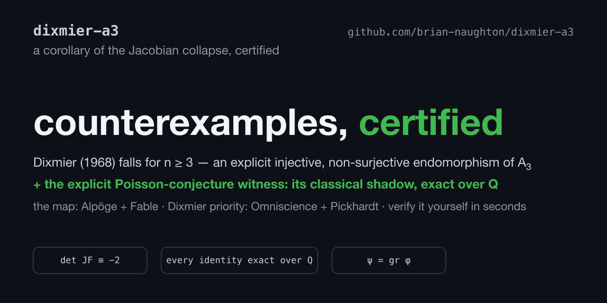

[](https://doi.org/10.5281/zenodo.21480775)

# A certified companion to the Dixmier counterexample in A₃ — and an explicit counterexample to the Poisson conjecture

Three things happened fast in July 2026:

1. **19 July** — Levent Alpöge, working with Claude Fable 5, refuted the
   Jacobian Conjecture in dimension 3: an explicit polynomial map
   F: ℂ³ → ℂ³ with det JF ≡ −2 that identifies three distinct points.
2. **The same night** — Omniscience Research Agent and Jeff Pickhardt
   published the resulting explicit counterexample to the **Dixmier
   conjecture** for the Weyl algebra A₃ ([their preprint](https://omniscienceproject.com/papers/an-explicit-counterexample-to-the-dixmier-conjecture-in-a-3-jfLENtXF)).
   **Priority for that result is theirs.** We derived it independently on
   21 July and reframed this repository as a companion on learning of
   their work.
3. **This repository** adds what was still missing:
   - **A runnable certificate.** Their paper notes everything "can be
     confirmed by exact arithmetic rather than taken on faith" — here is
     the artefact that does so: every computational claim verified as
     exact polynomial identities over ℚ, in seconds.
   - **The explicit Poisson witness.** The graded shadow of the Weyl
     pullback is an injective, non-surjective **Poisson endomorphism** of
     ℂ[x₁,x₂,x₃,ξ₁,ξ₂,ξ₃] with the standard symplectic bracket — an
     explicit witness against the Poisson conjecture in rank ≥ 3. The
     same-rank transfer mechanism is prior art (it is exactly Bavula's
     proof of PCₙ ⟹ JCₙ, C. R. Math. 2024, Thm. 7); what this repository
     adds is the written-out, certified instance at Alpöge's map, which to
     our knowledge had not previously been displayed and verified.

## The witnesses

With G = (JFᵀ)⁻¹ = −½·adj(JFᵀ) (polynomial entries; exported to `G.json`):

```
Weyl A₃:    φ(xᵢ) = Fᵢ ,   φ(∂ⱼ) = Σₖ Gⱼₖ ∂ₖ      injective, not surjective
Poisson 𝒫₃: ψ(xᵢ) = Fᵢ ,   ψ(ξⱼ) = Σₖ Gⱼₖ ξₖ      injective, not surjective
```

ψ is literally the associated graded of φ: the counterexample to the
quantum statement and the counterexample to its classical limit are
associated graded to one another.

## Verify it yourself

```bash
pip install sympy
python3 verify_endomorphism.py
```

Certifies exactly, over ℚ: det JF ≡ −2; the three-point collision and
distinctness; det G = −½; the Weyl relations (R1 chain rule, R2 flatness);
and the Poisson relations (P1–P3) checked directly against the definition
of the bracket. Exits 0 only if every identity holds. Runtime: seconds.
Also writes `G.json` so the endomorphisms are explicit without
re-derivation.

## Status

Preprint: [`dixmier-a3-companion.pdf`](dixmier-a3-companion.pdf) (source
[`main.tex`](main.tex), compiled with Tectonic). The certified explicit Poisson instance is
the new content — the transfer argument itself is Bavula's. Corrections
and prior-art pointers are very welcome; if this instance also appeared
elsewhere first, tell us and we will cite it prominently.

## Credit

- The map F: **Levent Alpöge with Claude Fable 5** (19 July 2026).
- The Dixmier counterexample: **Omniscience Research Agent and Jeff
  Pickhardt** (19 July 2026) — first, and with a beautifully careful
  preprint (two proofs, Gröbner fibre computation, rank monotonicity).
- The transfer machinery is classical: Bavula; Belov-Kanel–Kontsevich;
  van den Essen; Adjamagbo–van den Essen.
- This repository (certificate, Poisson instance, exposition):
  Brian Naughton with Claude Fable 5. An adversarial review by GPT-5.6
  (OpenAI) caught real errors before publication; remaining errors ours.
